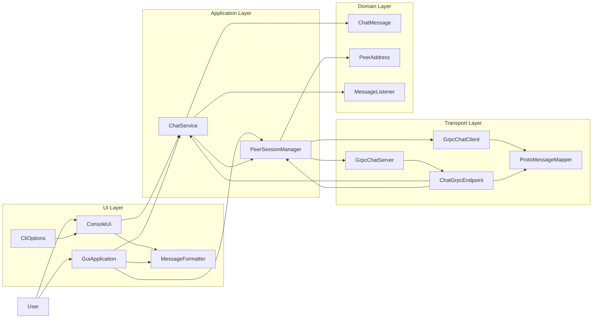
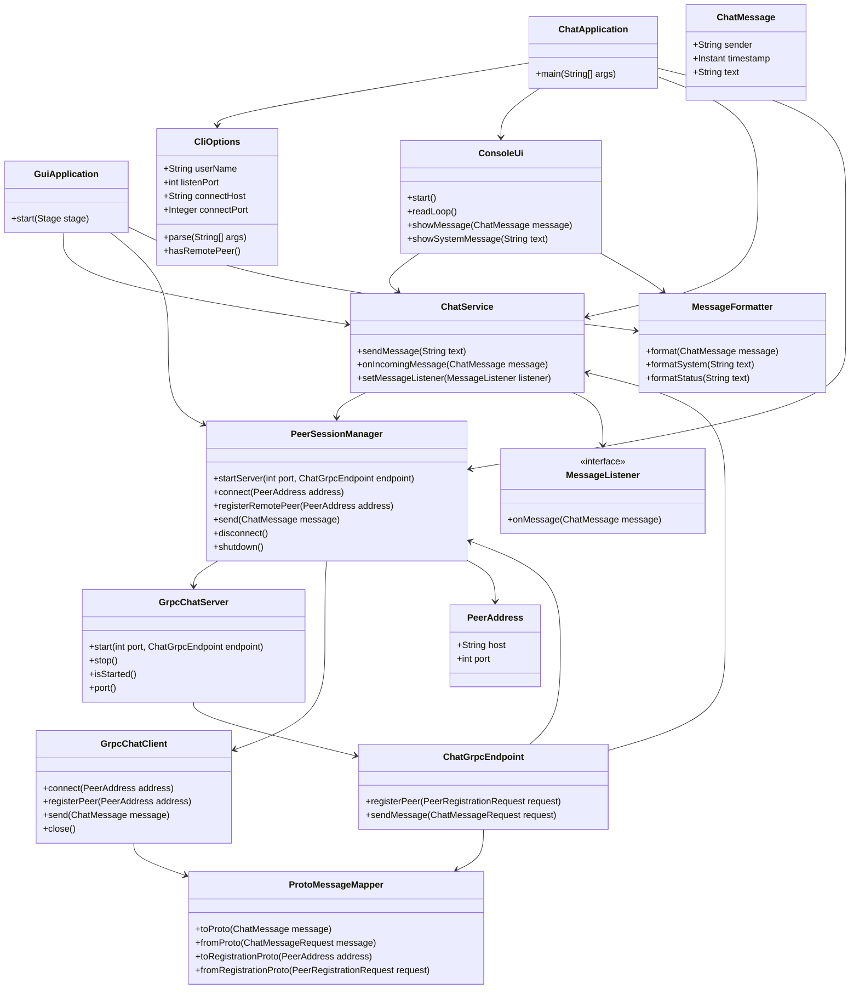
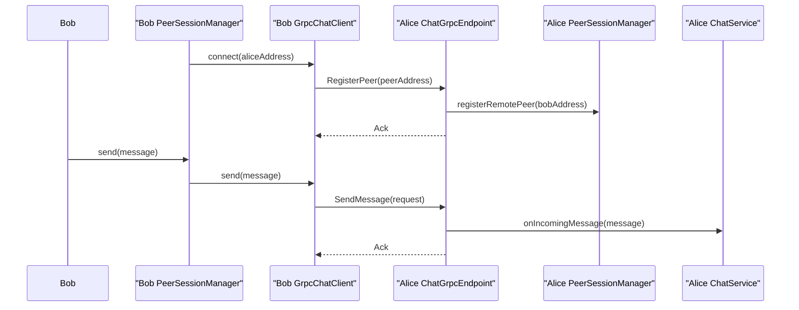

# Dialexis - Архитектурная документация

## 1. Назначение системы

Dialexis - это peer-to-peer чат для обмена текстовыми сообщениями между двумя узлами без центрального сервера. Приложение поддерживает два пользовательских интерфейса:

- консольный интерфейс;
- графический интерфейс на JavaFX.

Каждый экземпляр приложения одновременно является:

- gRPC-сервером для приема входящих запросов;
- gRPC-клиентом для отправки сообщений и handshake-запросов другому peer.

Такой подход сохраняет требование прямого соединения между узлами и позволяет организовать двусторонний обмен сообщениями без центрального координатора.

## 2. Формализованные требования

### 2.1. Функциональные требования

`FR-1.` Система должна поддерживать прямой обмен сообщениями между двумя peer-узлами без центрального сервера хранения и маршрутизации.

`FR-2.` Система должна поддерживать запуск в серверном режиме, если адрес удаленного peer не указан.

`FR-3.` Система должна поддерживать запуск в клиентском режиме, если при старте переданы адрес и порт удаленного peer.

`FR-4.` Пользователь должен задавать собственное имя при запуске приложения.

`FR-5.` Сообщение должно содержать:

- имя отправителя;
- дату и время отправки;
- текст сообщения.

`FR-6.` Сообщения должны отображаться в читаемом виде.

`FR-7.` Система должна принимать пользовательский ввод и отправлять сообщения подключенному peer.

`FR-8.` Система должна принимать входящие сообщения и отображать их без перезапуска приложения.

`FR-9.` При ошибке подключения или отправки система должна сообщать об этом пользователю понятным текстом.

`FR-10.` После подключения клиента серверный узел тоже должен иметь возможность инициировать отправку сообщений.

### 2.2. Параметры запуска

Консольное приложение поддерживает следующие CLI-аргументы:

- `--name <username>` - имя текущего пользователя, обязательный параметр;
- `--port <port>` - локальный порт для запуска собственного gRPC-сервера, обязательный параметр;
- `--connect-host <host>` - адрес удаленного peer, опциональный параметр;
- `--connect-port <port>` - порт удаленного peer, опциональный параметр.

Если `--connect-host` и `--connect-port` не переданы, узел работает в режиме ожидания входящего подключения.

Если `--connect-host` и `--connect-port` переданы, узел после локального старта пытается подключиться к удаленному peer и выполнить handshake.

### 2.3. Нефункциональные требования

`NFR-1.` Решение должно быть реализовано на языке Java.

`NFR-2.` Архитектура должна разделять пользовательский интерфейс, бизнес-логику, транспортный слой и модель данных.

`NFR-3.` Код должен быть покрыт модульными и интеграционными тестами для ключевых сценариев.

`NFR-4.` Проект должен содержать архитектурную документацию с диаграммами и кратким описанием принятых решений.

`NFR-5.` Структура проекта должна оставаться достаточно простой для учебного задания и не содержать избыточных слоев.

## 3. Ключевые архитектурные решения

### 3.1. Почему Java

Java выбрана как язык, хорошо подходящий для разработки сетевых многопоточных приложений, с поддержкой gRPC, удобной структуризацией кода и зрелыми средствами тестирования. Это позволяет реализовать чат с чистой архитектурой без избыточной сложности.

### 3.2. Почему gRPC

gRPC выбран по следующим причинам:

- строгий контракт обмена сообщениями через `.proto`;
- автоматическая генерация клиентского и серверного кода;
- удобная типизация сообщений;
- аккуратная транспортная граница для peer-to-peer взаимодействия.

В текущей реализации gRPC используется для двух сценариев:

- `RegisterPeer` - handshake при подключении;
- `SendMessage` - отправка текстового сообщения.

### 3.3. Почему handshake

Отдельный handshake нужен для того, чтобы серверный узел мог отправлять сообщения обратно сразу после подключения клиента, а не только после получения первого сообщения. Это делает архитектуру чище, чем передача обратного адреса внутри каждого chat payload.

### 3.4. Почему два UI

Консольный интерфейс нужен для прямого выполнения требования задания.

JavaFX GUI добавлен как дополнительный пользовательский интерфейс поверх того же прикладного и транспортного ядра. Это позволяет переиспользовать логику без дублирования сетевого кода.

## 4. Архитектурный стиль

Система строится как многослойное приложение с двумя UI-оболочками:

```text
CLI UI / GUI UI
-> Application
-> Transport (gRPC)

Domain Model - используется слоями Application, UI и Transport
```

Разделение ответственности:

- `ui` отвечает за ввод, отображение сообщений и форматирование;
- `application` координирует сценарии отправки, приема, подключения и отключения;
- `transport` инкапсулирует gRPC-сервер, клиент и protobuf-преобразования;
- `domain` содержит основные модели данных.

## 5. Диаграмма компонентов



## 6. Описание компонентов

### 6.1. `ConsoleUi`

Отвечает за:

- чтение пользовательского ввода;
- вывод сообщений и системных статусов;
- запуск интерактивного цикла чтения.

### 6.2. `GuiApplication`

Отвечает за:

- запуск JavaFX-окна;
- ввод имени, локального порта и адреса peer;
- отправку сообщений через общий прикладной слой;
- отображение статуса подключения и истории сообщений.

### 6.3. `MessageFormatter`

Отвечает за форматирование:

- обычных chat-сообщений;
- системных сообщений;
- человекочитаемых transport-статусов.

### 6.4. `CliOptions`

Отвечает за разбор аргументов командной строки и валидацию обязательных параметров.

### 6.5. `ChatService`

Центральный прикладной сервис. Отвечает за:

- создание доменного сообщения из пользовательского ввода;
- отправку сообщения через менеджер сессии;
- обработку входящего сообщения;
- уведомление UI о новых сообщениях.

### 6.6. `PeerSessionManager`

Отвечает за жизненный цикл локального узла:

- запуск локального gRPC-сервера;
- подключение к удаленному peer;
- выполнение handshake-регистрации;
- отправку сообщений;
- отключение и остановку transport-слоя.

### 6.7. `GrpcChatServer`

Запускает и останавливает локальный gRPC-сервер.

### 6.8. `GrpcChatClient`

Инкапсулирует gRPC-канал и удаленные вызовы:

- `registerPeer(...)`;
- `send(...)`.

### 6.9. `ChatGrpcEndpoint`

Серверная реализация gRPC-сервиса, принимающая handshake и chat-сообщения и передающая их в application layer.

### 6.10. `ProtoMessageMapper`

Преобразует:

- `ChatMessage <-> ChatMessageRequest`;
- `PeerAddress <-> PeerRegistrationRequest`.

### 6.11. `ChatMessage`

Доменная модель сообщения:

- `sender`;
- `timestamp`;
- `text`.

### 6.12. `PeerAddress`

Значимый объект, содержащий `host` и `port` удаленного peer.

## 7. Диаграмма классов



## 8. Диаграмма последовательности отправки сообщения



## 9. Контракт gRPC

В проекте используется следующий контракт:

```proto
syntax = "proto3";

package dialexis.chat;

service ChatEndpoint {
  rpc RegisterPeer (PeerRegistrationRequest) returns (ChatMessageAck);
  rpc SendMessage (ChatMessageRequest) returns (ChatMessageAck);
}

message PeerRegistrationRequest {
  string host = 1;
  int32 port = 2;
}

message ChatMessageRequest {
  string sender = 1;
  string timestamp = 2;
  string text = 3;
}

message ChatMessageAck {
  bool delivered = 1;
}
```

## 10. Предлагаемая структура проекта

```text
dialexis/
├── docs/
│   ├── ARCHITECTURE.md
│   └── TEST_PLAN.md
├── code/
│   ├── src/
│   │   ├── main/
│   │   │   ├── java/
│   │   │   │   └── ru/nsu/dialexis/
│   │   │   │       ├── app/
│   │   │   │       ├── application/
│   │   │   │       ├── domain/
│   │   │   │       ├── transport/grpc/
│   │   │   │       └── ui/
│   │   │   ├── proto/
│   │   │   │   └── chat.proto
│   │   │   └── resources/
│   │   └── test/
│   │       └── java/
│   ├── build.gradle
│   └── settings.gradle
└── README.md
```

## 11. Тестирование

В проекте уже реализованы:

- модульные тесты `CliOptions`;
- модульные тесты `ChatService`;
- модульные тесты `ProtoMessageMapper`;
- тесты форматирования сообщений;
- интеграционные тесты gRPC-доставки, handshake и ошибки недоступного peer.

## 12. Ограничения

- Базовый peer-to-peer сценарий ориентирован на одного активного собеседника.
- В текущей реализации локальный адрес для handshake регистрируется как `127.0.0.1`, поэтому сценарий естественно ориентирован на запуск на одной машине.
- История сообщений не сохраняется между перезапусками.

## 13. Вывод

Текущая реализация соответствует учебному заданию и расширяет его дополнительным GUI при сохранении общего application/transport ядра. Документ отражает актуальное состояние проекта после реализации gRPC-handshake, консольного интерфейса, JavaFX GUI и базового набора тестов.
