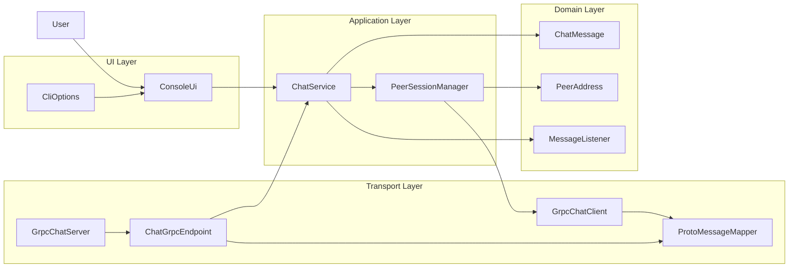
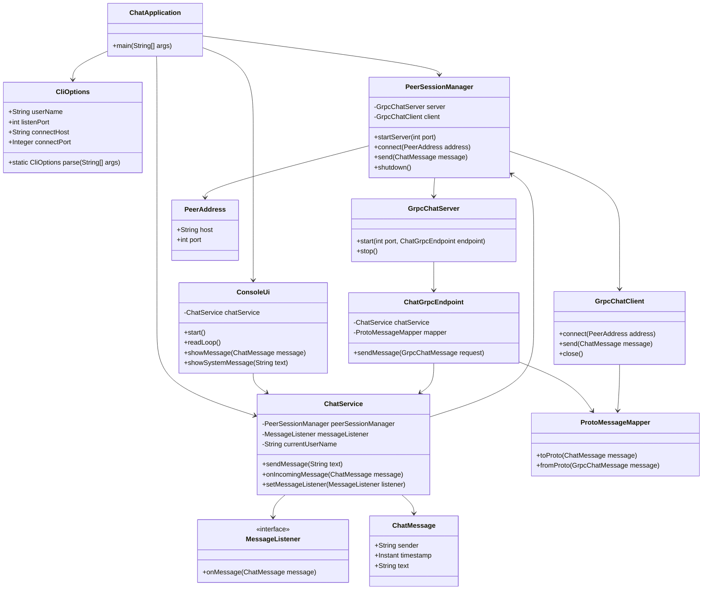
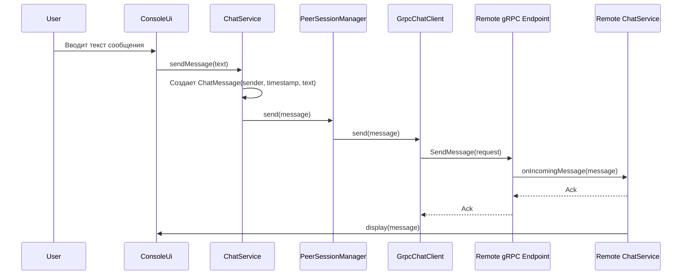
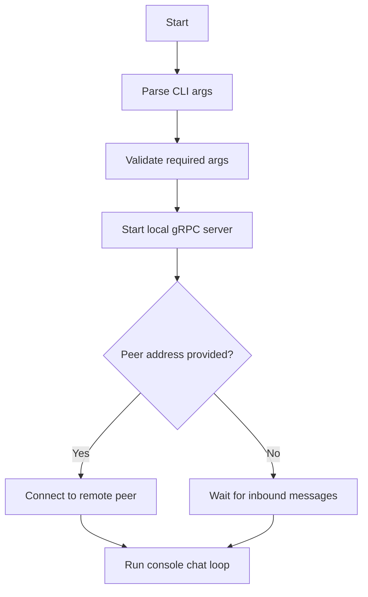

# Dialexis - Архитектурная документация

## 1. Назначение системы

Dialexis - это peer-to-peer чат для обмена текстовыми сообщениями между двумя узлами без центрального сервера. Приложение запускается из командной строки, позволяет либо ожидать входящее подключение, либо подключиться к уже запущенному peer-узлу.

В рамках проекта выбран стек `Java + gRPC`, при этом каждый экземпляр приложения одновременно является:

- gRPC-сервером для приема входящих сообщений;
- gRPC-клиентом для отправки сообщений другому peer.

Такой подход сохраняет требование прямого соединения между узлами и дает формализованный сетевой контракт через Protocol Buffers.

## 2. Формализованные требования

### 2.1. Функциональные требования

`FR-1.` Система должна поддерживать прямой обмен сообщениями между двумя peer-узлами без центрального сервера хранения и маршрутизации.

`FR-2.` Система должна поддерживать запуск в серверном режиме, если адрес удаленного peer не указан.

`FR-3.` Система должна поддерживать запуск в клиентском режиме, если при старте переданы адрес и порт удаленного peer.

`FR-4.` Пользователь должен задавать собственное имя при запуске приложения.

`FR-5.` Сообщение должно содержать:

- имя отправителя;
- дату и время отправки;
- текст сообщения.

`FR-6.` Сообщения должны отображаться в консольном интерфейсе в читаемом виде.

`FR-7.` Система должна принимать пользовательский ввод из консоли и отправлять сообщения подключенному peer.

`FR-8.` Система должна принимать входящие сообщения и отображать их без перезапуска приложения.

`FR-9.` При ошибке подключения система должна сообщать об этом пользователю понятным текстом.

### 2.2. Параметры запуска

Приложение должно поддерживать следующие CLI-аргументы:

- `--name <username>` - имя текущего пользователя, обязательный параметр;
- `--port <port>` - локальный порт для запуска собственного gRPC-сервера, обязательный параметр;
- `--connect-host <host>` - адрес удаленного peer, опциональный параметр;
- `--connect-port <port>` - порт удаленного peer, опциональный параметр.

Если `--connect-host` и `--connect-port` не переданы, узел работает в режиме ожидания входящего подключения.

Если `--connect-host` и `--connect-port` переданы, узел после локального старта пытается подключиться к удаленному peer.

### 2.3. Нефункциональные требования

`NFR-1.` Решение должно быть реализовано на языке Java 

`NFR-2.` Архитектура должна разделять пользовательский интерфейс, бизнес-логику, транспортный слой и модель данных.

`NFR-3.` Код должен быть покрыт модульными и интеграционными тестами для ключевых сценариев.

`NFR-4.` Проект должен содержать архитектурную документацию с диаграммами и кратким описанием принятых решений.

`NFR-5.` Структура проекта должна оставаться достаточно простой для учебного задания и не содержать избыточных слоев.

## 3. Ключевые архитектурные решения

**Java** выбрана как язык, хорошо подходящий для разработки сетевых многопоточных приложений, с поддержкой gRPC, удобной структуризацией кода и зрелыми средствами тестирования. Это позволяет реализовать чат с чистой архитектурой без избыточной сложности.

**gRPC** выбран по следующим причинам:

- строгий контракт обмена сообщениями через `.proto`;
- автоматическая генерация клиентского и серверного кода;
- удобная типизация сообщений;
- более аккуратная и расширяемая транспортная граница по сравнению с ручной сериализацией поверх сокетов.

Для данного проекта gRPC используется умеренно: только как транспорт между двумя peer-узлами без дополнительных микросервисных практик.

## 4. Архитектурный стиль

Система строится как многослойное приложение:

```text
UI (Console)
-> Application
-> Transport (gRPC)
-> Domain Model
```

Разделение ответственности:

- `ui` отвечает только за ввод и вывод;
- `application` координирует сценарии отправки и приема сообщений;
- `transport` инкапсулирует gRPC-сервер, клиент и преобразование сообщений;
- `domain` содержит модели и контракты.

## 5. Диаграмма компонентов



## 6. Описание компонентов

### 6.1. `ConsoleUi`

Отвечает за:

- чтение пользовательского ввода;
- отображение системных сообщений;
- отображение входящих и исходящих сообщений в формате `"[timestamp] sender: text"`.

`ConsoleUi` не должен содержать сетевой логики и не должен напрямую работать с gRPC.

### 6.2. `CliOptions`

Отвечает за разбор аргументов командной строки, валидацию обязательных параметров и выбор режима запуска.

### 6.3. `ChatService`

Центральный прикладной сервис. Отвечает за:

- создание доменного сообщения из пользовательского ввода;
- отправку сообщения через менеджер сессии;
- обработку входящего сообщения;
- уведомление UI о новых сообщениях.

### 6.4. `PeerSessionManager`

Отвечает за жизненный цикл локального узла:

- запуск локального gRPC-сервера;
- подключение к удаленному peer при наличии адреса;
- хранение текущего активного клиента;
- делегирование отправки сообщений.

### 6.5. `GrpcChatServer`

Запускает локальный gRPC-сервер на указанном порту и публикует endpoint для приема сообщений.

### 6.6. `ChatGrpcEndpoint`

Серверная реализация gRPC-сервиса, принимающая protobuf-сообщение, преобразующая его в доменную модель и передающая его в `ChatService`.

### 6.7. `GrpcChatClient`

Инкапсулирует gRPC-канал и удаленный вызов `sendMessage(...)` к peer-узлу.

### 6.8. `ProtoMessageMapper`

Отвечает за преобразование между protobuf-моделью и внутренней моделью `ChatMessage`.

### 6.9. `ChatMessage`

Доменная модель сообщения:

- `sender`;
- `timestamp`;
- `text`.

### 6.10. `PeerAddress`

Значимый объект, содержащий `host` и `port` удаленного peer.

## 7. Диаграмма классов



## 8. Диаграмма последовательности отправки сообщения



## 9. Сценарий запуска приложения



## 10. Контракт gRPC

В проекте предлагается использовать следующий контракт:

```proto
syntax = "proto3";

package dialexis.chat;

service ChatEndpoint {
  rpc SendMessage (ChatMessageRequest) returns (ChatMessageAck);
}

message ChatMessageRequest {
  string sender = 1;
  string timestamp = 2;
  string text = 3;
}

message ChatMessageAck {
  bool delivered = 1;
}
```


## 11. Предлагаемая структура проекта

```text
dialexis/
├── docs/
│   └── ARCHITECTURE.md
├── src/
│   ├── main/
│   │   ├── java/
│   │   │   └── ru/nsu/dialexis/
│   │   │       ├── app/
│   │   │       ├── ui/
│   │   │       ├── application/
│   │   │       ├── transport/grpc/
│   │   │       └── domain/
│   │   └── proto/
│   │       └── chat.proto
│   └── test/
│       └── java/
└── README.md
```

## 12. Декомпозиция задач между двумя участниками

### Юлия Бурмистрова

Зона ответственности:

- проектирование доменной модели и структуры пакетов;
- реализация `ChatService`, `CliOptions`, `ConsoleUi`;
- валидация параметров запуска;
- модульные тесты прикладного слоя;
- подготовка README и пользовательской инструкции запуска.

### Анастасия Малышева

Зона ответственности:

- описание и генерация gRPC-контракта;
- реализация `GrpcChatServer`, `GrpcChatClient`, `ChatGrpcEndpoint`;
- управление соединением через `PeerSessionManager`;
- интеграционные тесты сетевого взаимодействия;
- подготовка диаграмм и архитектурного описания транспортного слоя.

### Совместные задачи

- согласование формата сообщений и публичных интерфейсов;
- ревью pull request друг друга;
- финальная проверка сценариев запуска.
